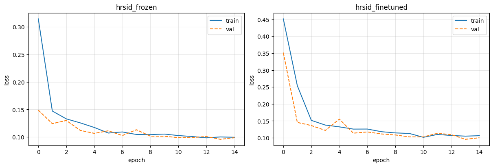
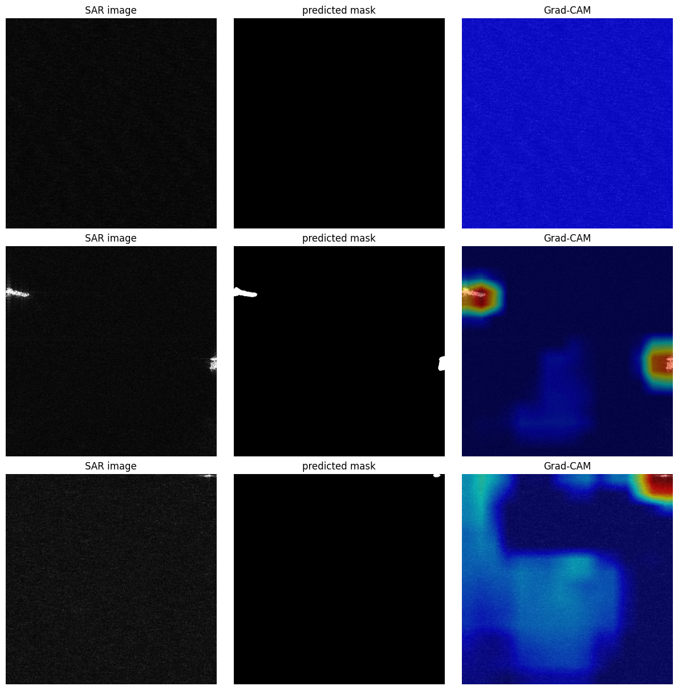
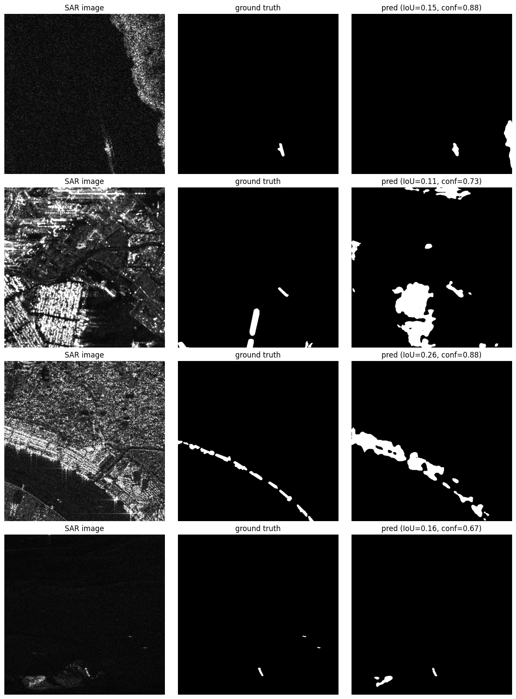
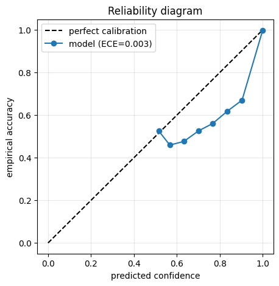

# SAR Ship Segmentation — DeepLabV3+

I built DeepLabV3+ from scratch (custom ASPP + decoder, ImageNet-pretrained Xception encoder) and applied it to [HRSID](https://github.com/chaozhong2010/HRSID), a Synthetic Aperture Radar ship segmentation dataset, in [`HRSID_Segmentation.ipynb`](HRSID_Segmentation.ipynb).

**Headline finding**: freezing the ImageNet encoder and training only the ASPP and decoder **matches full fine-tuning** (val mIoU 0.766 vs 0.764) at identical inference latency, ~50% lower training cost, and with *less* boundary-IoU penalty. Fine-tuning does change the model — Grad-CAM shows it gathers evidence far more sharply — but it trades that for slightly blurrier mask boundaries, and the two effects cancel in the headline metric.

## Why SAR

SAR is a radar imaging modality, not optical: grayscale, speckle-noise-heavy, works day/night through cloud cover. Segmenting it is a genuinely different problem from RGB semantic segmentation — different edge statistics, different noise model. The point of this project was to test whether an architecture I designed on street scenes holds up on a modality it was never designed around.

## Dataset

**[HRSID](https://github.com/chaozhong2010/HRSID)** — 5,604 high-resolution SAR images (800×800), 16,951 ship instances, pixel-level instance masks, built from TerraSAR-X/Sentinel-1B/TanDEM-X scenes, COCO-format annotations. I rasterize the COCO instance polygons into binary ship/background masks and train on a subsampled split: **3,096 train / 546 val** tiles at 512×512, batch size 8, 15 epochs per variant.

## Architecture

- **Decoder / ASPP**: my own implementation (`SeparableConv`, `ASPP`, `DecoderBlock`), originally written for a companion Cityscapes project.
- **Encoder**: a from-scratch `XceptionModel` is kept in the notebook for reference but **not used for training** — an ImageNet-pretrained Xception (`timm`) is used instead. Training a 16-block Xception from scratch needs far more epochs than a single Colab session allows; the pretrained backbone converges in a handful. Full reasoning in the notebook.
- **Loss**: BCE + Dice (`BCEDiceLoss`). Checkpoint selection is on best **val loss**, with mIoU reported at that same epoch.

## Experiments

All run in Google Colab on a T4. Each has my own written interpretation in the notebook, not just the plot:

1. **Transfer learning** — frozen vs. fine-tuned pretrained encoder
2. **Grad-CAM** — where the model looks when predicting "ship"
3. **Failure case analysis** — high-confidence, low-IoU validation images
4. **Boundary IoU vs. full IoU** — isolates DeepLabV3+'s known weak point (fine boundary precision) from overall accuracy
5. **Calibration / ECE** — is the model's confidence trustworthy?
6. **Accuracy vs. latency** — the real cost of fine-tuning
7. **Extra visualizations** — boundary-gap chart, and a 30-row frozen-vs-fine-tuned side-by-side with both variants' masks and Grad-CAMs

## Results

| | |
|---|---|
|  |  |
| Frozen vs. fine-tuned loss curves | Grad-CAM overlay on a validation SAR image |
|  |  |
| Confident-but-wrong failure cases | Reliability diagram (ECE = 0.003) |

| Variant | Val mIoU | Val loss | Full mIoU | Boundary mIoU | Boundary gap | Latency (ms/batch) |
|---|---|---|---|---|---|---|
| Frozen encoder | **0.766** | 0.0958 | 0.656 | 0.657 | **−0.001** | 252.2 |
| Fine-tuned | 0.764 | **0.0952** | 0.656 | 0.642 | +0.013 | 257.0 |

### What the numbers mean

- **The mIoU gap is noise, not a win.** 0.002 between variants, from one run each. Within each run, val mIoU swings ~0.01 across the last five epochs — five times larger than the gap. The defensible claim is that the two are *indistinguishable on this evidence, and frozen is strictly cheaper*, not that frozen wins.
- **The latency difference is also noise** — identical architectures and parameter counts, so a 2% gap is kernel autotuning and thermals on a shared T4. There is no accuracy/latency tradeoff here; the real cost of fine-tuning is training time.
- **The boundary gap is the interesting result.** Both variants have identical full-image IoU, so the whole difference sits in the boundary band. Frozen keeps ImageNet's high-frequency edge filters intact by construction; letting the encoder adapt under a Dice-weighted loss (which barely notices a one-pixel edge shift) blurs them a little.
- **ECE = 0.003 is flattering and should not be quoted alone.** HRSID is overwhelmingly background, so nearly all pixels land in the top confidence bin and dominate the bin-weighted average. The reliability curve is the honest artefact: between 0.5 and 0.9 confidence it sits clearly below the diagonal, i.e. the model is over-confident exactly where it is unsure.
- **Dominant failure mode: coastal and urban clutter.** Buildings, quays and piers produce bright compact returns that look like hulls in single-channel amplitude SAR. Second failure mode: ships only a few pixels across, which barely survive an output-stride-16 encoder.

*Val mIoU and Full mIoU are two different metrics, not a typo* — Val mIoU is `iou_score` from the training loop (batch-averaged, with an epsilon term); Full mIoU is `evaluate_boundary_vs_full`'s per-image IoU averaged over the whole validation set (no epsilon, images with an empty union excluded). Only Val-to-Val and Full-to-Full comparisons across variants are meaningful.

## Limitations & next steps

The honest weak point is that every comparison is a **single training run per variant** — no repeated seeds, no confidence intervals. Given more compute I'd spend it on 3 seeds per variant before adding any new experiment, since that is what decides whether the boundary-IoU effect is real. After that, in order: a land/coastline mask as an extra input channel (aimed at the dominant failure mode), temperature scaling to make the confidences usable at thresholds other than 0.5, TTA, and an augmentation sweep.

## Running it

**Primary path — Google Colab** (this is where training actually happens):
1. Open `HRSID_Segmentation.ipynb` in Colab.
2. Runtime → Change runtime type → **T4 GPU** (not A100 — on Colab, A100 only gives its real speedup at half precision, which this project doesn't need; T4 is the better price/availability tradeoff here).
3. The setup cell downloads from a Kaggle mirror (`sarribere99/high-resolution-sar-images-dataset-hrsid`) — search Kaggle for "HRSID" and swap the slug if it has moved.
4. Run top to bottom. Checkpoints and metrics are mirrored to Google Drive (`/content/drive/MyDrive/HRSID-experiment`) so a disconnected runtime resumes instead of retraining from scratch.

Budget roughly **2–2.5 hours** end to end on a T4 (~35 min for the frozen run, ~55 min fine-tuned, the rest is setup and analysis) — see the time-budget table at the end of the notebook.

**Secondary path — local viewing via Docker** (browsing the notebook and its saved outputs, not training — there's no GPU passthrough configured):
```bash
make build
make jupyter
# open http://localhost:8888
```

**Linting** (for any future `.py` scripts — the notebook itself is excluded from Ruff/pre-commit, see `pyproject.toml`):
```bash
make setup   # installs deps + registers pre-commit hooks
make lint
make format
```

## Repo structure

```
HRSID_Segmentation.ipynb      # the project — SAR ship segmentation + experiments
docs/                         # result figures used in this README
requirements.txt              # dependency list (mirrors pyproject.toml)
pyproject.toml                # Ruff config, project metadata
.pre-commit-config.yaml       # pre-commit hooks (notebook excluded)
Dockerfile / Makefile         # local viewing environment
```

## Related

The ASPP/decoder architecture originates from a companion project, [CityScapesSegmentation](../CityScapesSegmentation) — a from-scratch DeepLabV3+ build on the Cityscapes street-scene dataset.

## License

MIT — see [LICENSE](LICENSE).
